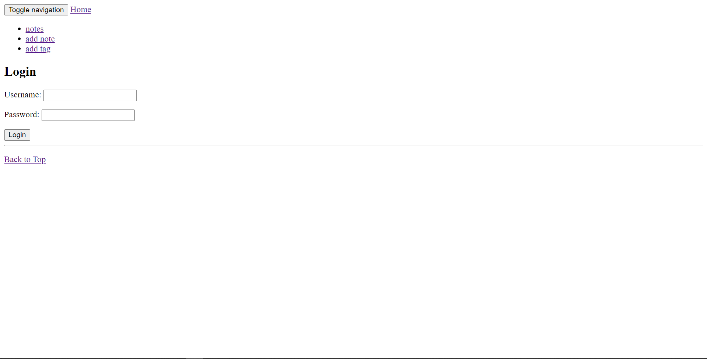
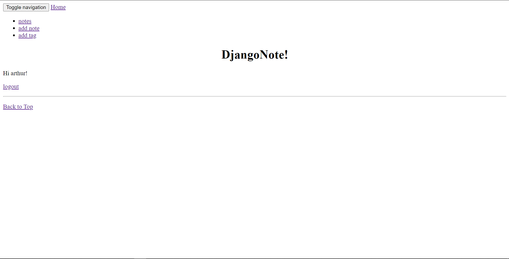
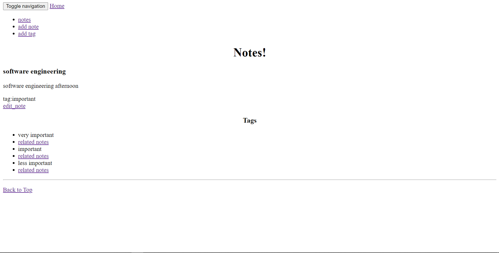
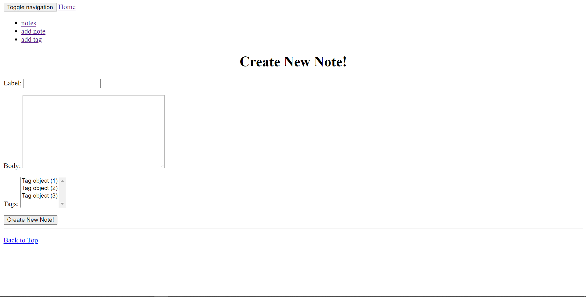
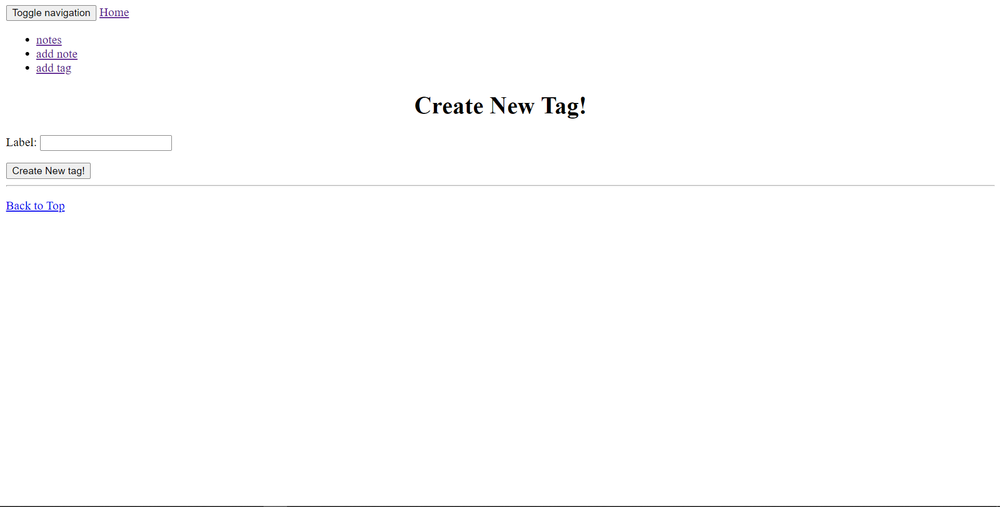

# Project Name
> djangoNote

## Table of contents
* [General info](#general-info)
* [Screenshots](#screenshots)
* [Technologies](#technologies)
* [design](#design)
* [Setup](#setup)
* [Features](#features)
* [Status](#status)
* [Inspiration](#inspiration)
* [Contact](#contact)

## General info
<!-- Add more general information about project. What the purpose of the project is? Motivation? -->
    DjangoNote is a webapp running on the server side which function as a notetaking app.
    It is my first software project and it currently run successfully on my computer port,
    I plan to upload it to heroku server, and add more functionalities on it.

## Screenshots
<!--  -->

## Technologies
* nothing special
## design
<!--  -->
the design concept is very simple. there are only two models.
* note - the note has label, body, and tags.
* tag - the tag has label and can be used to sort the notes.

## Setup
<!-- Describe how to install / setup your local environement / add link to demo version. -->
`pip install -r requirements.txt`

`python manage.py makemigrations`

`python manage.py migrate`

`python manage.py createsuperuser`
then input user name and password (the password may not show on the screen, just input it via keyboard)

`python manage.py runserver`
the app is running on your computer
<!-- ## Code Examples
Show examples of usage: -->
## Features
List of features ready and TODOs for future development
* See all of our existing notes
* Add a new note
* Edit and delete existing notes
* See all of our existing tags
* Create new tags
* Edit and delete existing tags
* Some basic search capability - find notes with a given tag

issues to fix:
* instead show the label of tags, the tags in the scroll of 
    note-editing page is objects
* besides, scroll seems not convinient to edit tags, you can choose a 
    tap for your note.

To-do list:
* update the code and upload it to heroku servers.
* add project model and corresponding views, project is a set of notes. 
* add subnotes feature for current note.
* create notes directly from the webpage on google blowser. 
* a stronger search mechanism which based on the content of notes, not the label.

## Status
<!-- Project is: _in progress_, _finished_, _no longer continue_ and why? -->
Project is in progress
## Inspiration
<!-- Add here credits. Project inspired by..., based on... -->
[Django Tutorial]:https://souldeux.com/blog/django-note-app-tutorial-part-1-layout-file-structure/
## Contact
arthur Wang email wzhvonurmqi@gmail.com - feel free to contact me!
